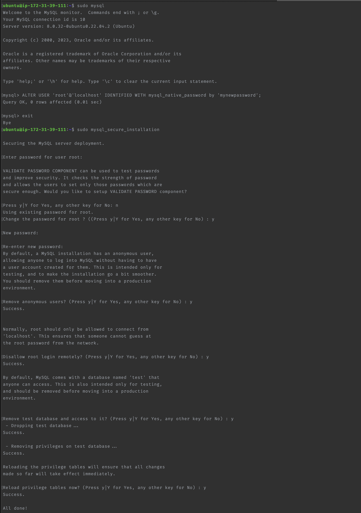
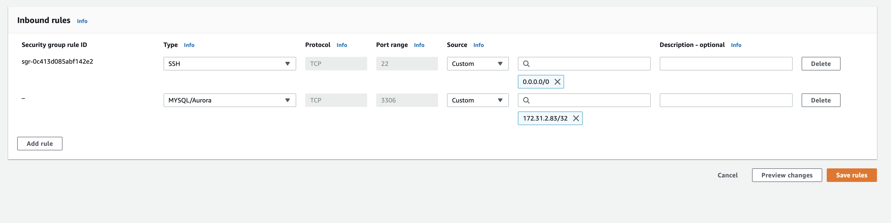
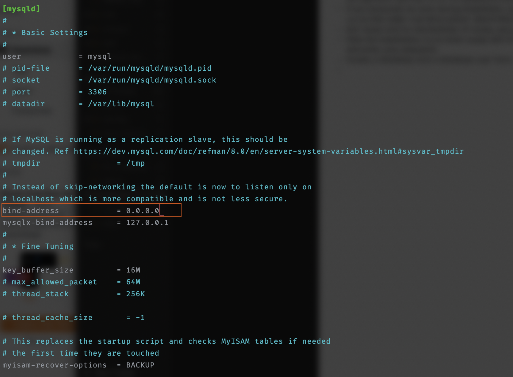
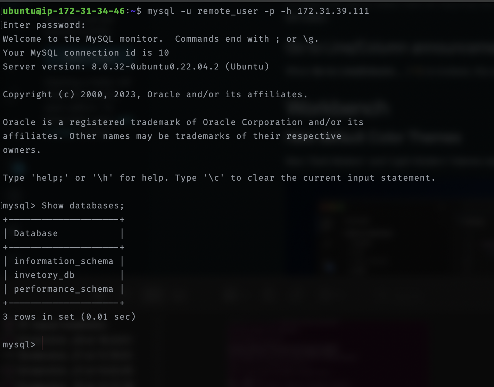

# IMPLEMENTATION OF A CLIENT SERVER ARCHITECTURE USING MYSQL DATABASE MANAGEMENT SYSTEM (DBMS)

## INTRODUCTION

  Client-server architecture connects two or more computers over a network to exchange requests and data. It involves one device acting as a server providing services or resources and other devices acting as clients requesting those services or resources. This architecture is commonly used in modern network-based applications. In this project, two computers(virtual severs) are made to connect to each other using MySQL which is a Relational Database Management System(RDBMS).

The following steps were taken in setting up a client-server architecture using MySQL:

## STEP 1: SET UP TWO VIRTUAL SERVERS IN AWS CLOUD

To showcase a basic client-server architecture using MySQL, launch two virtual servers (EC2 instances) on AWS cloud. Choose Ubuntu 20.04 LTS as the operating system for both servers. Configure one server as a client server and the other configured as MySQL database server. These servers are set up as follows:

- **Server A** – ‘mysql-client’
- **Server B** – 'db-server’

Once these two virtual servers have been configured, log in remotely to both servers from a local computer terminal using ssh. The command to connect from your local computer can be retrieved from the AWS instance connection pane.

**Update** and **Upgrade** the two virtual servers using this commands on both servers.

```console
sudo apt update
sudo apt upgrade
```

## STEP 2: INSTALL AND CONFIGURE MYSQL SERVER ON SERVER B (db-server)

Install MySQL server using the command below:

```console
sudo apt install mysql-server -y
```

Enable/Start the mysql service

```console
sudo systemctl enable mysql
```

Execute `mysql_secure_installation`. This will help improve security of mysql installation in the following ways:

- Set a password for root accounts.
- Remove root accounts that are accessible from outside the local host.
- Remove anonymous-user accounts.
- Remove the test database, which by default can be accessed by anonymous users.

````console
sudo mysql_secure_installation
````

If you encounter any error during installation, use this command to create a user in mysql

```console
$ mysql
mysql> ALTER USER 'root'@'localhost' IDENTIFIED WITH mysql_native_password by 'mynewpassword';
```



## STEP 3:  INSTALL AND CONFIGURE MYSQL CLIENT ON SERVER B

On the AWS client instance(mysql-cleint), install MySQL client using the command below:

```console
sudo apt install mysql-client -y
```

## STEP 4: CONFIGURE THE DATABASE SERVER TO ALLOW THE CLIENT SERVER REMOTE CONNECTION

For the client server(server A) to be able to connect to db-server(Server B), mysql-server is configured to allow connections from the client server.

- Update the db-server AWS instance inbound rule by adding the client server ip address to the list of ip. The update is carried out under the instance securtiy group.



- Then edit the **mysqld.cnf** file. In the file, change the value of bind-address from ‘127.0.0.1’ to ‘0.0.0.0’

```console
sudo nano /etc/mysql/mysql.conf.d/mysqld.cnf
```



- Restart mysql server for the changes to take effect

```console
sudo systemctl restart mysql
```

## STEP 5:  CREATE AND GRANT FULL ACCESS TO MYSQL USER IN SERVER B

To connect to server B from server A, a remote user is created and granted privileges on the db server. First create a database, create the remote user then grant the user access.

```console
$ sudo mysql
mysql> CREATE DATABASE test_app; # Create database
mysql> CREATE USER 'remote_user'@'%' IDENTIFIED WITH mysql_native_password BY'password';    # Create remove user 
mysql> GRANT ALL ON test_app.* TO 'remote_user'@'%' WITH GRANT OPTION;  # Grant user access
mysql> FLUSH PRIVILEGES; # Reload the grant tables
mysql> exit;
```

## STEP 6: CONNECT TO MYSQL DATABASE SEVER REMOTELY

The created user can now connect to MySQL server using this command:\

```console
mysql -u remote_user -h 172.31.39.111 -p 
```

Entering the remote user password will allow a successfully login to the db server.

This can be confirmed by showing the database on the server : `SHOW DATABSE;`


Connection has been successfully established

**We have successfully completed the Implementation of a client server architecture using MYSQL Database**
