# WEB SOLUTIONS WITH WORDPRESS

## INTRODUCTION

The task in this project is to prepare a storage infrastructure on two Linux servers and implement a basic web solution using WordPress. The backend Relational Database Management System (RDBMS) paired with WordPress is MySQL. During this project, a Three-tier Architecture will be showcased while also ensuring that the partitioning and management of the disks used for storing files on the Linux servers are adequately performed through programs such as gdisk and LVM.

The 3-Tier Setup:

- Personal Computer
- An EC2 Instance Linux Server as a Web Server (For WordPress Installation)
- An EC2 Instance Linux Server as a database (DB) Server

The Unix distro used in this project is Red Hat (Not Ubuntu).

## STEP 1: SET UP A WEB SERVER ON AWS AND ATTACH EBS VOLUMES TO THE SERVER

- On AWS, launch a new EC2 instance running on RedHat Unix Operating System (Red Hat Enterprise Linux 9 HVM). This will sever as the Web Server. The name assinged to this instance is web-server.

- Create 3 volumes with size of 10Gib each, in the same Availability Zone(AZ) as the web server and attach it to the web server.

- Connect to the web server remotely from your personal computer then inspect what blocks attached to the server using the `lsblk` command.

```shell
[ec2-user@ip-172-31-4-90 ~]$ lsblk
NAME    MAJ:MIN RM  SIZE RO TYPE MOUNTPOINTS
xvda    202:0    0   10G  0 disk 
├─xvda1 202:1    0    1M  0 part 
├─xvda2 202:2    0  200M  0 part /boot/efi
├─xvda3 202:3    0  500M  0 part /boot
└─xvda4 202:4    0  9.3G  0 part /
xvdf    202:80   0   10G  0 disk 
xvdg    202:96   0   10G  0 disk 
xvdh    202:112  0   10G  0 disk 
```

xvdf, xvdg and xvdh are the new volumes (block devices) created and attached to the web-server EC2 instance.

### STEP 1.2: CREATE A SINGLE PARTITION ON EACH OF THE 3 DISKS

In this Section, the following steps are performed:

- Create a partition on the physical disk
- Change partition type to Logical Volume Management (LVM)
- Create a physical Volume : Physical volumes can only be created on partitions and not directly on the physical disk.
- Create a Volume group
- Create a Logical Volume

Use `df-h` to check the mount points available on the drive. The newly created volumes are not listed as they are not mounted yet.

```shell
[ec2-user@ip-172-31-4-90 ~]$ df -h
Filesystem      Size  Used Avail Use% Mounted on
devtmpfs        446M     0  446M   0% /dev
tmpfs           478M     0  478M   0% /dev/shm
tmpfs           192M  5.3M  186M   3% /run
/dev/xvda4      9.4G  1.2G  8.2G  13% /
/dev/xvda3      495M  108M  388M  22% /boot
/dev/xvda2      200M  8.0K  200M   1% /boot/efi
tmpfs            96M     0   96M   0% /run/user/1000
```

The goal is to create a partition on the disk using the entire disk.

Use the command `sudo gdisk /dev/xvdf` to create a partition on the xvdf disk.

- Enter `n` key to add a new partition.
- Enter `1` for the first partition or leave it blank.
- Accept all the defaults settings for sectors.
- Select Linux LVM type of partition by entering 8E00 code.
- Entering the `p` key to check succesfully creatioin of the partition.
- Entering the `w` key to write the new partition created.
- Confirm with the `y` and hit enter.

This will successfully create a partion on the selected disk, in this case that's **xvdf**.

```shell
[ec2-user@ip-172-31-4-90 ~]$ sudo gdisk /dev/xvdf
GPT fdisk (gdisk) version 1.0.7

Partition table scan:
  MBR: not present
  BSD: not present
  APM: not present
  GPT: not present

Creating new GPT entries in memory.

Command (? for help): n
Partition number (1-128, default 1): 1
First sector (34-20971486, default = 2048) or {+-}size{KMGTP}: 
Last sector (2048-20971486, default = 20971486) or {+-}size{KMGTP}: 
Current type is 8300 (Linux filesystem)
Hex code or GUID (L to show codes, Enter = 8300): 8e00
Changed type of partition to 'Linux LVM'

Command (? for help): p
Disk /dev/xvdf: 20971520 sectors, 10.0 GiB
Sector size (logical/physical): 512/512 bytes
Disk identifier (GUID): 26909834-D491-475F-87A4-5A36E12CF7FA
Partition table holds up to 128 entries
Main partition table begins at sector 2 and ends at sector 33
First usable sector is 34, last usable sector is 20971486
Partitions will be aligned on 2048-sector boundaries
Total free space is 2014 sectors (1007.0 KiB)

Number  Start (sector)    End (sector)  Size       Code  Name
   1            2048        20971486   10.0 GiB    8E00  Linux LVM

Command (? for help): w

Final checks complete. About to write GPT data. THIS WILL OVERWRITE EXISTING
PARTITIONS!!

Do you want to proceed? (Y/N): Y
OK; writing new GUID partition table (GPT) to /dev/xvdf.
The operation has completed successfully.
```

Follow the same guide to partition disk xvdg and xvdh.

Check to confirm successful creation of the partition using `lsblk`

```shell
[ec2-user@ip-172-31-4-90 ~]$ lsblk
NAME    MAJ:MIN RM  SIZE RO TYPE MOUNTPOINTS
xvda    202:0    0   10G  0 disk 
├─xvda1 202:1    0    1M  0 part 
├─xvda2 202:2    0  200M  0 part /boot/efi
├─xvda3 202:3    0  500M  0 part /boot
└─xvda4 202:4    0  9.3G  0 part /
xvdf    202:80   0   10G  0 disk 
└─xvdf1 202:81   0   10G  0 part 
xvdg    202:96   0   10G  0 disk 
└─xvdg1 202:97   0   10G  0 part 
xvdh    202:112  0   10G  0 disk 
└─xvdh1 202:113  0   10G  0 part 
```

Install *`lvm2`* package using `sudo yum install lvm2`.

Run `sudo lvmdiskscan` command to check for available partitions.

```shell
[ec2-user@ip-172-31-4-90 ~]$ sudo lvmdiskscan
  /dev/xvda2 [     200.00 MiB] 
  /dev/xvda3 [     500.00 MiB] 
  /dev/xvda4 [       9.31 GiB] 
  /dev/xvdf1 [     <10.00 GiB] 
  /dev/xvdg1 [     <10.00 GiB] 
  /dev/xvdh1 [     <10.00 GiB] 
  0 disks
  6 partitions
  0 LVM physical volume whole disks
  0 LVM physical volumes
```

Use *`pvcreate`* utility to mark each of the 3 disks partitions as physical volumes (PVs) to be used by LVM. Use *`sudo pvs`* to verify the physical volumes are created successfully.

```shell
[ec2-user@ip-172-31-4-90 ~]$ sudo pvcreate /dev/xvdf1 /dev/xvdg1 /dev/xvdh1
  Physical volume "/dev/xvdf1" successfully created.
  Physical volume "/dev/xvdg1" successfully created.
  Physical volume "/dev/xvdh1" successfully created.
  Creating devices file /etc/lvm/devices/system.devices
[ec2-user@ip-172-31-4-90 ~]$ sudo pvs
  PV         VG Fmt  Attr PSize   PFree  
  /dev/xvdf1    lvm2 ---  <10.00g <10.00g
  /dev/xvdg1    lvm2 ---  <10.00g <10.00g
  /dev/xvdh1    lvm2 ---  <10.00g <10.00g
```

Use *`vgcreate`* utility to add all 3 PVs to a volume group (VG). Name the VG webdata-vg.

```shell
[ec2-user@ip-172-31-4-90 ~]$ sudo vgcreate webdata-vg /dev/xvdf1 /dev/xvdg1 /dev/xvdh1
  Volume group "webdata-vg" successfully created
[ec2-user@ip-172-31-4-90 ~]$ sudo vgs
  VG         #PV #LV #SN Attr   VSize   VFree  
  webdata-vg   3   0   0 wz--n- <29.99g <29.99g
[ec2-user@ip-172-31-4-90 ~]$ 
```

Use *`lvcreate`* utility to create 2 logical volumes. One half of the volume will be used to store data for the Website name (***apps-lv***) and the other will be used to store the logs (***log-lv***).
After the creation of the two volume groups, check they have been successfully v by running *`sudo lvs`*. You can now verify the entire setup using

```shell
[ec2-user@ip-172-31-4-90 ~]$ sudo lvcreate -n apps-lv -L 14G webdata-vg
  Logical volume "apps-lv" created.
[ec2-user@ip-172-31-4-90 ~]$ sudo lvcreate -n logs-lv -L 14G webdata-vg
  Logical volume "logs-lv" created.
[ec2-user@ip-172-31-4-90 ~]$ sudo lvs
  LV      VG         Attr       LSize  Pool Origin Data%  Meta%  Move Log Cpy%Sync Convert
  apps-lv webdata-vg -wi-a----- 14.00g                                                    
  logs-lv webdata-vg -wi-a----- 14.00g    
```

### STEP 1.3: FORMAT AND MOUNT THE LOGICAL VOLUMES

Use *`mkfs.ext4`* to format the logical volumes with ext4 filesystem

```shell
[ec2-user@ip-172-31-4-90 ~]$ sudo mkfs -t ext4 /dev/webdata-vg/apps-lv
mke2fs 1.46.5 (30-Dec-2021)
Creating filesystem with 3670016 4k blocks and 917504 inodes
Filesystem UUID: 7f31c99f-62ce-43be-a6ab-4aab03e7850d
Superblock backups stored on blocks: 
 32768, 98304, 163840, 229376, 294912, 819200, 884736, 1605632, 2654208

Allocating group tables: done                            
Writing inode tables: done                            
Creating journal (16384 blocks): done
Writing superblocks and filesystem accounting information: done   

[ec2-user@ip-172-31-4-90 ~]$ sudo mkfs -t ext4 /dev/webdata-vg/logs-lv
mke2fs 1.46.5 (30-Dec-2021)
Creating filesystem with 3670016 4k blocks and 917504 inodes
Filesystem UUID: 18e30b05-07c5-4aa6-9c27-8161ef038ffe
Superblock backups stored on blocks: 
 32768, 98304, 163840, 229376, 294912, 819200, 884736, 1605632, 2654208

Allocating group tables: done                            
Writing inode tables: done                            
Creating journal (16384 blocks): done
Writing superblocks and filesystem accounting information: done 
```

Create **/var/www/html** directory to store website files and **/home/recovery/logs** to store backup of log data

```shell
[ec2-user@ip-172-31-4-90 ~]$ sudo mkdir -p /var/www/html 
[ec2-user@ip-172-31-4-90 ~]$ sudo mkdir -p /home/recovery/logs
```

Mount apps-lv on /var/www/html using the command `sudo mount /dev/webdata-vg/apps-lv /var/www/html`.

Use *`rsync*` utility to backup all the files in the log directory /var/log into /home/recovery/logs.

```shell
sudo rsync -av /var/log/. /home/recovery/logs/
```

Mount **logs-lv** logical volume on **/var/log** .

> Ensure the directory you intend to mount on is empty before mounting. The `mount` command will delete the content of the directory before mounting. Contents in the log file is backed up using the `rsync` command before mounting the volume.

```shell
sudo mount /dev/webdata-vg/logs-lv /var/log
```

Restore log files back into /var/log directory

```shell
sudo rsync -av /home/recovery/logs/. /var/log
```

### Step 1.4: UPDATE THE **/ETC/FSTAB** FILE

Update **/etc/fstab** file so that the mount configuration will persist after restart of the server.

Retrieve the UUID of the mounted volumes using *`sudo blkid`* as it will be used in updating the **/etc/fstab** file.

```shell
[ec2-user@ip-172-31-4-90 ~]$ sudo blkid | grep webdata
/dev/mapper/webdata--vg-logs--lv: UUID="18e30b05-07c5-4aa6-9c27-8161ef038ffe" BLOCK_SIZE="4096" TYPE="ext4"
/dev/mapper/webdata--vg-apps--lv: UUID="7f31c99f-62ce-43be-a6ab-4aab03e7850d" BLOCK_SIZE="4096" TYPE="ext4"
```

Use a text editor to update the **/etc/fstab file with : `sudo vi /etc/fstab`. Ensure to follow the format of the other volumes in the file.

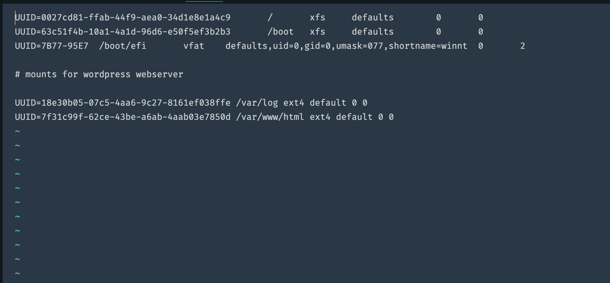

Test the configuration and reload the daemon to verify the configuration is successful. The command `sudo mount -a` is used to test the configuration and should not return anything. If any output is returned, then it indicates there is an error in the configuration.

```shell
[ec2-user@ip-172-31-4-90 ~]$ sudo mount -a
[ec2-user@ip-172-31-4-90 ~]$ sudo systemctl daemon-reload
```

## STEP 2: PREPARE THE DATABASE SERVER

In this section, an EC2 instance is created with the name db-server. All the setup procedures for the websever is also executed. The exceptios are as follows:

- Replace the name **webdata-vg** with **dbdata-vg** when creating a volume group.
- Also replace the name **apps-lv** with **db-lv** when creating the logical volumes.

Create **/db** directory to store database files and **/home/recovery/logs** to store backup of log data

```shell
[ec2-user@ip-172-31-10-151 ~]$  sudo mkdir /db
[ec2-user@ip-172-31-10-151 ~]$  sudo mkdir -p /home/recovery/logs
```

Mount **db-lv** logical volume on **/db** using the command `sudo mount /dev/dbdata-vg/ db-lv /db`.

Use *`rsync*` utility to backup all the files in the log directory /var/log into /home/recovery/logs.

```shell
sudo rsync -av /var/log/. /home/recovery/logs/
```

Mount **logs-lv** logical volume on **/var/log** .

> Ensure the directory you intend to mount on is empty before mounting. The `mount` command will delete the content of the directory before mounting. Contents in the log file is backed up using the `rsync` command before mounting the volume.

```shell
sudo mount /dev/dbdata-vg/logs-lv /var/log
```

Restore log files back into /var/log directory

```shell
[ec2-user@ip-172-31-10-151 ~]$ sudo rsync -av /home/recovery/logs/. /var/log
[ec2-user@ip-172-31-10-151 ~]$ df -h
Filesystem                       Size  Used Avail Use% Mounted on
devtmpfs                         446M     0  446M   0% /dev
tmpfs                            478M     0  478M   0% /dev/shm
tmpfs                            192M  5.3M  186M   3% /run
/dev/xvda4                       9.4G  1.2G  8.2G  13% /
/dev/xvda3                       495M  108M  388M  22% /boot
/dev/xvda2                       200M  8.0K  200M   1% /boot/efi
tmpfs                             96M     0   96M   0% /run/user/1000
/dev/mapper/dbdata--vg-db--lv     14G   24K   13G   1% /db
/dev/mapper/dbdata--vg-logs--lv   14G  1.5M   13G   1% /var/log
```

Like the websever setup, retrieve the UUID of the mounted volumes and use a text editor to update **/etc/fstab** file so that the mount configuration will persist after restart of the server. Check the configuration after modifying the file and then reload the the daemon.

```shell
[ec2-user@ip-172-31-4-90 ~]$ sudo mount -a
[ec2-user@ip-172-31-4-90 ~]$  sudo systemctl daemon-reload
```

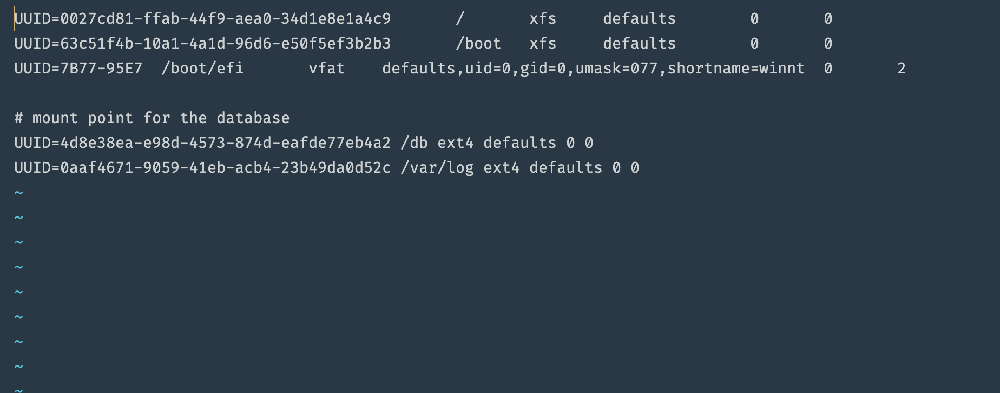

## STEP 3: INSTALL WORDPRESS ON THE WEBSEVER EC2

1. First, update the repository using

      ```shell
      sudo yum update
      ```

2. Then install wget, apache and its dependencies:

    ```shell
    sudo yum -y install wget httpd php php-mysqlnd php-fpm php-json
    ```

3. Start Apache

    ```shell
    sudo systemctl enable httpd
    sudo systemctl start httpd
    ```

4. Install PHP and it's dependecies:

    Reference Link: <https://www.tecmint.com/install-lamp-on-centos-8/>

    ```shell
    sudo yum install https://dl.fedoraproject.org/pub/epel/epel-release-latest-9.noarch.rpm # epel repository
    ```

    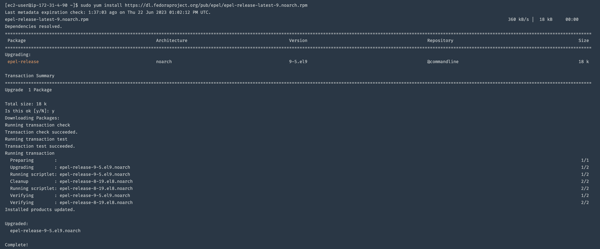

    ```shell
    sudo yum install yum-utils http://rpms.remirepo.net/enterprise/remi-release-9.rpm # yum utils
    ```

    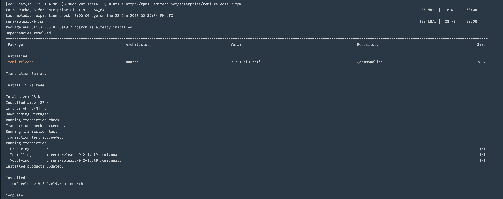

    ```shell
    sudo yum module list php  # display php modules available
    ```

    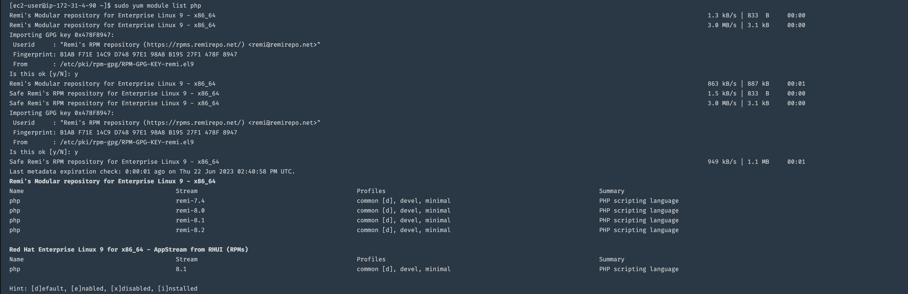

    ```shell
    sudo yum module reset php # reset php module
    ```

    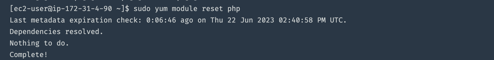

    ```shell
    sudo yum module enable php:remi-8.1 # enable php 8.1 module
    ```

     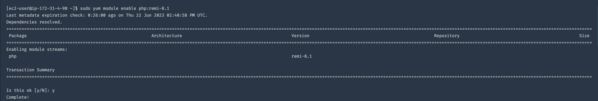

    ```shell
    sudo yum install php php-opcache php-gd php-curl php-mysqlnd  # install associated PHP modules.
    php -v # check php version
    ```

    ```shell
    sudo systemctl start php-fpm  # start php-fpm
    sudo systemctl enable php-fpm # enable php-fpm
    sudo systemctl status php-fpm # check status of php-fpm
    ```

    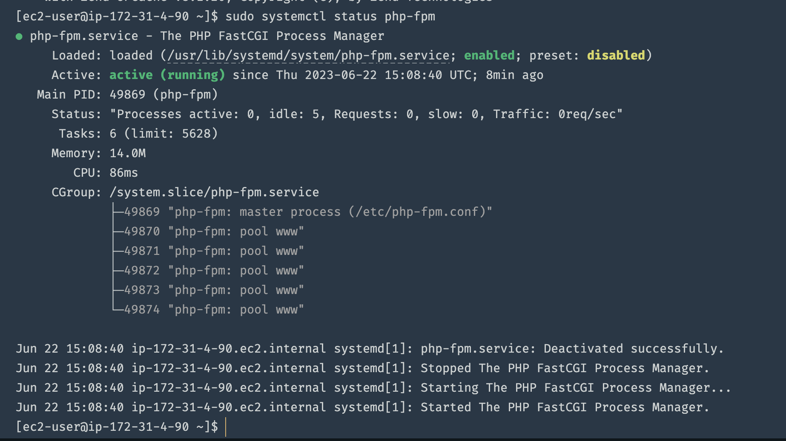

    sudo setsebool -P httpd_execmem 1  # instruct SELinux to allow Apache to execute php via php-fpm

5. Restart Apache

    ```shell
    sudo systemctl restart httpd # restart Apache web server
    ```

6. Download wordpress and copy wordpress to *`var/www/html`*

    ```shell
    mkdir wordpress # make new directory
    cd   wordpress  # change directory to the wordpress directory
    sudo wget http://wordpress.org/latest.tar.gz  # download the wordpress file
    sudo tar xzvf latest.tar.gz # extract the word press file
    sudo rm -rf latest.tar.gz #   remove downloaded archive
    sudo cp -R wp-config-sample.php wp-config.php # copy the configsample to wp-config.php
    sudo cp -R wordpress/. /var/www/html/
    ```

    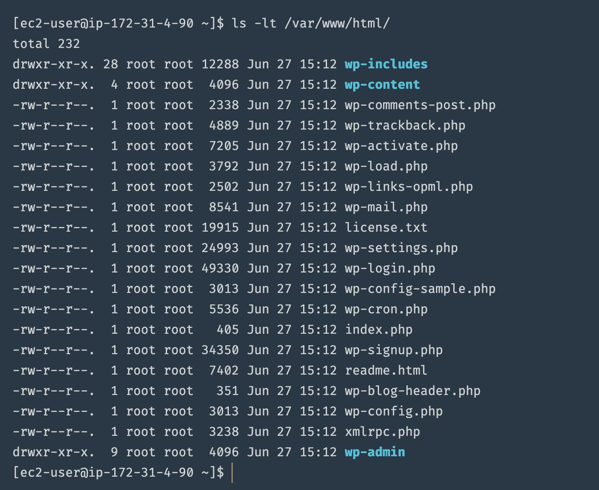

7. Install Mysql server on the web server

    ```shell
    sudo yum install mysql-server # install mysql-server
    ```

## STEP 4: Install MySQL on your DB Server EC2

```shell
sudo yum update
sudo yum install mysql-server
sudo systemctl restart mysqld
sudo systemctl enable mysqld
```

## Step 5: Configure DB to work with WordPress

```shell
sudo mysql -u root - p
CREATE DATABASE wordpress;
CREATE USER 'wordpress_user'@'%' IDENTIFIED with mysql_native_password BY 'pass001';
GRANT ALL ON wordpress.* TO 'wordpress_user'@'%';
FLUSH PRIVILEGES;
SHOW DATABASES;
exit
```

Update the config file to allow access to the DB and restart mysql

```shell
sudo vi /etc/my.cnf
sudo systemctl restart mysqld
```

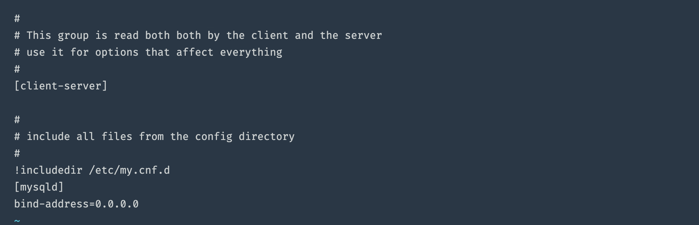

## Step 6: Configure WordPress to connect to remote database

Update wp-config file with the newly created database user, password and ip addreass

```shell
sudo vi /var/www/html/wp-config.php 
```

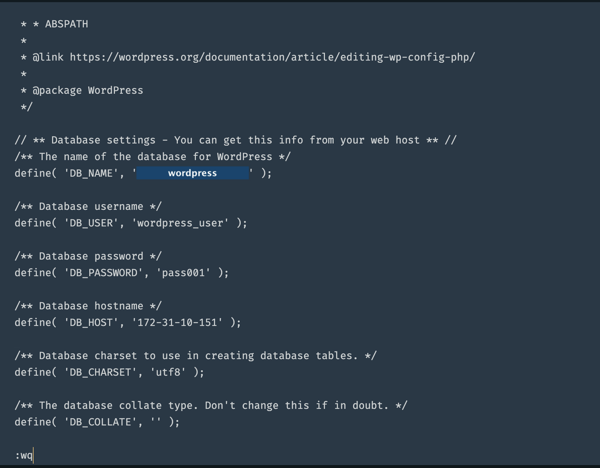

```shell
sudo systemctl restart httpd
```

Confirm web-server can communicate with Database server

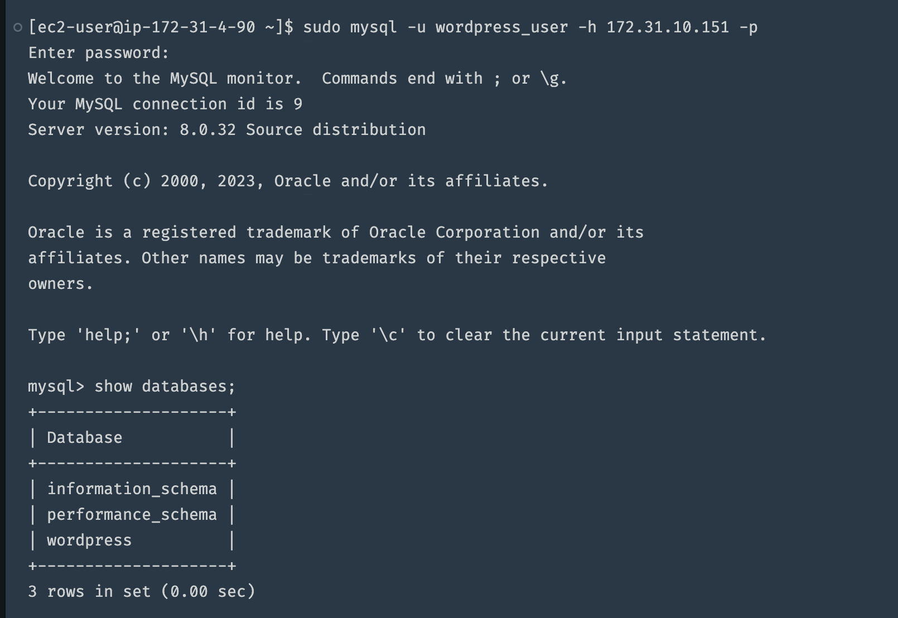

Disable Apache welcome Page

```shell
sudo mv /etc/httpd/conf.d/welcome.conf /etc/httpd/conf.d/welcome.conf_backup
```

Open MySQL Port 3306 on the DB instance to allow access to the DB server only from the webserver IP.
In this case the security group is open to all service.

Change permissions and configuration so Apache could use WordPress:
Configure SELinux Policies

```shell
sudo chown -R apache:apache /var/www/html/
sudo chcon -t httpd_sys_rw_content_t /var/www/html/ -R
sudo setsebool -P httpd_can_network_connect=1
```

Access from your browser the link to your WordPress <http://3.235.250.52/>. Then create an account. 

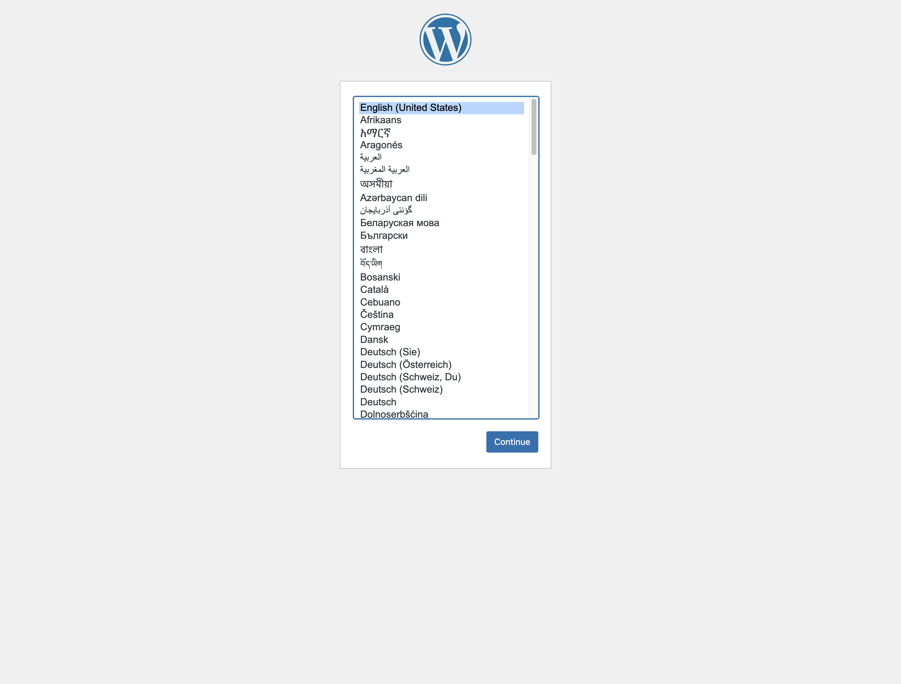
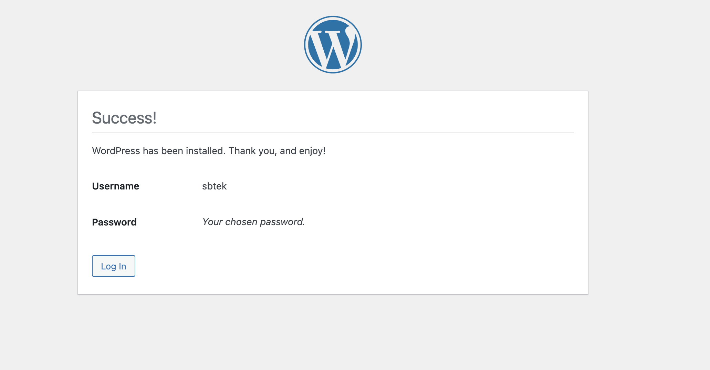

Log into Wordpress to confirm setup

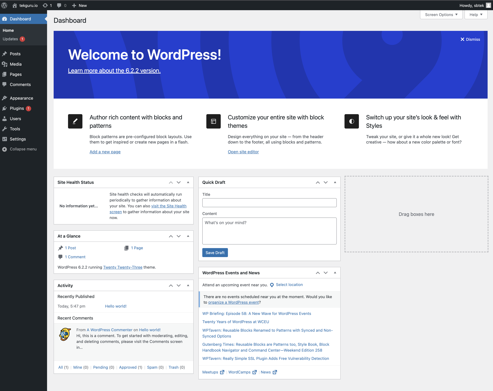

